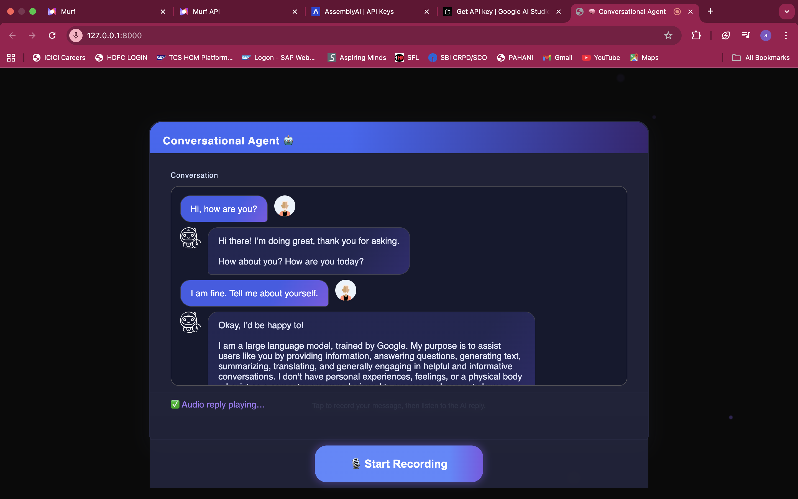

# Conversational AI Agent

> 🧠 Real‑time voice conversations with AI — sleek glassmorphic UI + production‑grade backend  
> Built in 30 days as part of the #30DaysOfAIVoiceAgents challenge 🚀


## 🚀 Project Overview
This project is a web-based, production-grade conversational AI agent that enables seamless voice interaction with an AI. It takes a user's spoken input, processes it through a series of AI services, and returns a spoken and textual response. This architecture ensures a smooth, real-time conversational flow with a user-friendly interface.

## ✨ Features
 🎙️ Voice-to-Text Transcription: Utilizes the powerful **AssemblyAI** SDK to accurately convert spoken language into text.

 🧠 AI-Powered Chat: Leverages the **Google Gemini** model to generate intelligent and context-aware responses.

 🔊 Text-to-Speech Generation: Uses the **Murf AI** platform to synthesize the AI's text responses into natural-sounding audio.* 🌐 Modern UI: A clean, responsive, and interactive user interface with a glassmorphic design.

 💾 Dynamic Chat History: Maintains a per-session conversation history to provide context for the AI's responses.

 🚦 Intelligent Status Bar: The UI's status bar dynamically changes color and animation to indicate the current state (Ready, Recording,  Processing, Replying).

 🛡️ Robust Error Handling: The backend is designed to gracefully handle failures from any of the external APIs, providing a fallback message and audio to the user.

## 🛠 Technologies Used
 **Backend**: Python with `FastAPI`
 **Frontend**: HTML, CSS, JavaScript (client-side)
 **Speech-to-Text (STT)**: **AssemblyAI**
 **Large Language Model (LLM)**: **Google Gemini**
 **Text-to-Speech (TTS)**: **Murf AI**
 **Web APIs**: Web Audio API for a live, mic-reactive button pulse

## 🏗 Architecture
The application follows a client-server model with a multi-stage, server-side processing pipeline:

1.  **Frontend**: The UI handles user interaction. It uses the Web Audio API to capture the user's voice and sends the recorded audio as a 
`.webm` file to the backend.

2.  **Backend (FastAPI)**: The `main.py` file serves the core API endpoints.

3.  **Request Flow**:
    * An audio file is uploaded to the `/agent/chat/{session_id}` endpoint.
    * **Speech-to-Text**: The file is sent to **AssemblyAI** for transcription.
    * **LLM Generation**: The transcribed text is combined with the session's chat history and sent to the **Google Gemini** model to generate a new response.
    * **Text-to-Speech**: The generated text response is broken into chunks and sent to the **Murf API** to produce corresponding audio files.
    * **Response**: The server returns the user's transcription, the AI's text response, and the URLs of the generated audio files.

4.  **Audio Playback**: The frontend receives the response and automatically plays the audio files for the user.

<br>
<p align="center">
  
</p>
<br>

## ⚙️ How to Run

### Step 1: Clone the repository (if applicable) and navigate into the project directory

```
# Example:
# git clone <repository_url>
# cd <repository_folder>
```

### Step 2: Install dependencies

Install the required Python libraries listed in `requirements.txt` using pip:

```
pip install -r requirements.txt
```

### Step 3: Set up environment variables

The application requires API keys for AssemblyAI, Murf, and Google Gemini. Set these as environment variables in your terminal session before starting the server.

```
export MURF_API_KEY="your_murf_key"
export ASSEMBLYAI_API_KEY="your_assemblyai_key"
export GEMINI_API_KEY="your_gemini_key"
```

You can obtain these keys from their respective websites:

  * **Murf**: [https://murf.ai/]
  * **AssemblyAI**: [https://www.assemblyai.com/]
  * **Google Gemini**: [https://ai.google.dev/]

### Step 4: Start the API server

Run the FastAPI application with `uvicorn` to start the local server. The `--reload` flag is useful for development as it automatically restarts the server on code changes.

```
uvicorn main:app --reload
```

### Step 5: Access the UI

Open your web browser and navigate to `http://127.0.0.1:8000` to access the conversational agent and begin your voice chat.

-----

*Disclaimer: API keys are confidential and should not be shared or committed to version control.*

## 🛠 Troubleshooting

**1. No microphone detected**
- Check your browser permissions — allow microphone access.
- Refresh the page after granting permission.

**2. "No audio returned" warning**
- Check that your `MURF_API_KEY` is valid and active.
- Make sure you haven’t hit Murf API rate limits.

**3. "Empty transcription" error**
- Ensure your microphone is capturing audio (watch the record button glow).
- Speak clearly and ensure background noise is minimal.

**4. Server not starting / ImportError**
- Make sure all required Python packages are installed:
  ```
  pip install fastapi uvicorn python-multipart assemblyai murf google-generativeai
  ```

**5. API key issues**
- Do **not** hardcode keys in `main.py` — use environment variables.
- Verify:
  ```
  echo $MURF_API_KEY
  echo $ASSEMBLYAI_API_KEY
  echo $GEMINI_API_KEY
  ```
  return the correct values before starting the server.

**6. Audio doesn’t autoplay**
- Some browsers block autoplay — interact with the page (click, tap) before recording.
- Test in Chrome or Edge for the best compatibility.

---
## 📝 Additional Suggestions

- Add a `.gitignore` file to exclude files like `.DS_Store`, `__pycache__`, and `.env` to keep the repo clean.

- Consider adding a brief project description and usage example to the README for clarity.

- Include information about the `services/` directory to highlight modular code design.

- Always keep API keys secure; do not commit secrets to the repository.

---

### 👋 Thanks for Watching & Reading!

That’s a wrap for this build in the **#30DaysOfAIVoiceAgents** challenge.  
Your support, feedback, and suggestions mean a lot! 💡💬  
Follow along for more AI experiments — see you in the next project! 🚀🎙

